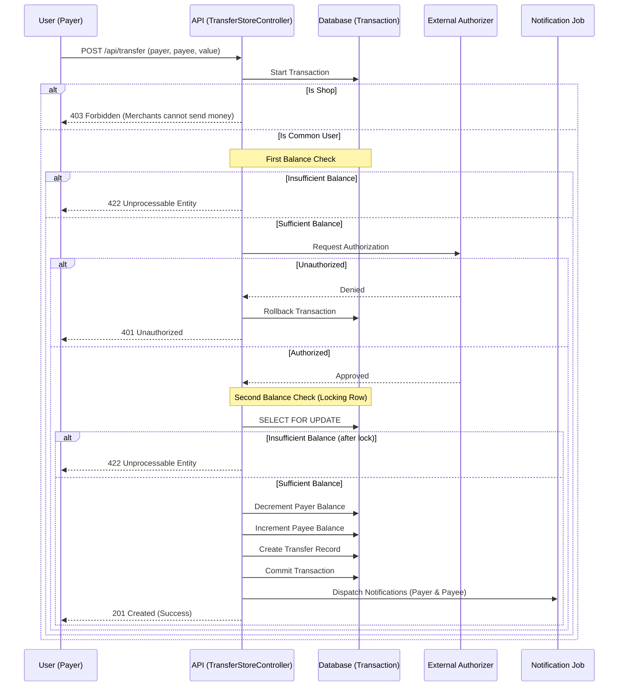

This is a simplified fintech application. It aims to simulate transactions between clients and shop wallets.

The registration methods exist only for data population purposes, and certain wallet and transfer GET methods are provided solely for demonstration. This is why these endpoints are not authenticated and do not include security layers.

The main endpoint of this application is POST /api/transfer. It handles transfers between users (common to common or common to shop) while ensuring atomicity by locking the user's wallet in the database and sending notifications via background jobs.

Transfers use external authorization and notification services. These were originally designed to use https://util.devi.tools/api/v2/authorize and https://util.devi.tools/api/v1/notify. However, as these services are currently unstable, mocks were implemented to simulate network delays and failures.

## Transfer Flow

The following diagram describes the business logic orchestrated by the `HandleTransferAction`:

the documentation generated by scribe can be seen on /docs
