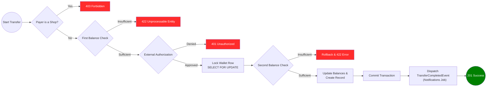

# Simplified Fintech API

This is a simplified fintech application designed to simulate transactions between client and shop wallets.

The registration methods exist primarily for data population purposes. Additionally, certain wallet and transfer GET methods are provided solely for demonstration; therefore, these endpoints are not authenticated and do not include security layers.

The core feature of this application is the `POST /api/transfer` endpoint. It manages transfers between users (Common to Common or Common to Shop) while ensuring atomicity by implementing database row-level locking on the user's wallet and dispatching an event to process notifications via background jobs. It also accepts an X-Idempotency-Key header to prevent duplicate transfers.

### External Services and Reliability

Transfers integrate with external authorization and notification services. The system was originally designed to consume:

* Authorization: `https://util.devi.tools/api/v2/authorize`
* Notification: `https://util.devi.tools/api/v1/notify`

Due to the current instability of these providers, mock implementations were developed to simulate network delays and service failures, ensuring the application remains testable and resilient.

## Transfer Flow

The following diagram describes the business logic orchestrated by the `HandleTransferAction`:



## Observability & Resiliency

* **Telescope:** Integrated to observe jobs, events, logs, commands, and exceptions. It can be accessed at `/telescope` in local environment.
  * **TraceId:** Integrated via Laravel 11's Context to provide full cross-service request tracing. It correlates HTTP requests with their respective logs and background jobs. Can be observed in Laravel Telescope.
* **Self-Healing (Scheduler):** A periodic task ensures that any failed notification is eventually re-processed (Queue Retry), maintaining eventual consistency even during prolonged external service downtime.
* **Queue Strategies:** Implementation of exponential backoff and multiple retries for asynchronous tasks.


## API Documentation

The complete API documentation, generated via Scribe, is available at:
`/docs`


## How to Run

The application uses **Laravel Sail** to manage the Docker environment. Follow these steps to set up the project:

1. **Prepare Environment**
```bash
cp .env.example .env

```


2. **Install Dependencies**
   (Run this to install dependencies via Docker if you don't have PHP/Composer installed locally)
```bash
docker run --rm \
    -u "$(id -u):$(id -g)" \
    -v "$(pwd):/var/www/html" \
    -w /var/www/html \
    laravelsail/php84-composer:latest \
    composer install --ignore-platform-reqs --no-scripts

```


3. **Start Containers**
```bash
./vendor/bin/sail up -d

```


4. **Initialize Application**
```bash
./vendor/bin/sail artisan key:generate
./vendor/bin/sail artisan migrate
```

5. **Run tests**
```bash
./vendor/bin/sail artisan test
```

